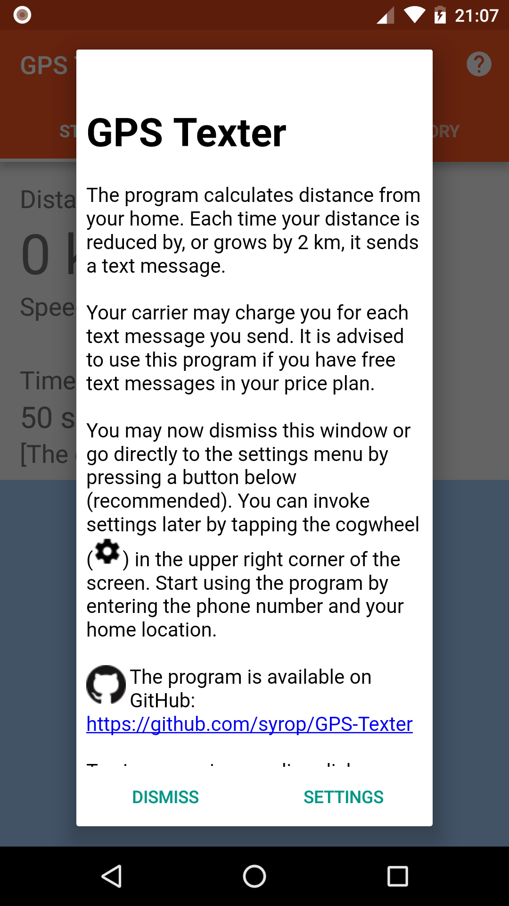
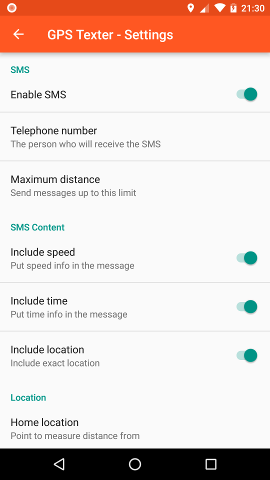
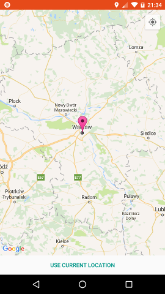
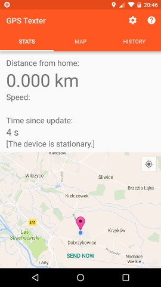

# GPS-Texter (Android)
Sends a text message each time your distance from home changes by 2 km.

The program calculates distance from your home. Each time your distance is reduced by, or grows by 2 km, it sends a text message.

Press [SETTINGS] in the startup dialog.

In the settings menu click "Enable SMS", enter phone number, select which details are going to be sent with each sms and select your phone location.

Once your home location is set, the program continues to send an sms when your distance from home changes significantly (by 2 km).

Please note that your carrier may charge you for each text message you send. It is advised to use this program if you have free text messages in your price plan.

**Donate bitcoin:** 36uxha7sy4mv6c9LdePKjGNmQe8eK16aX6